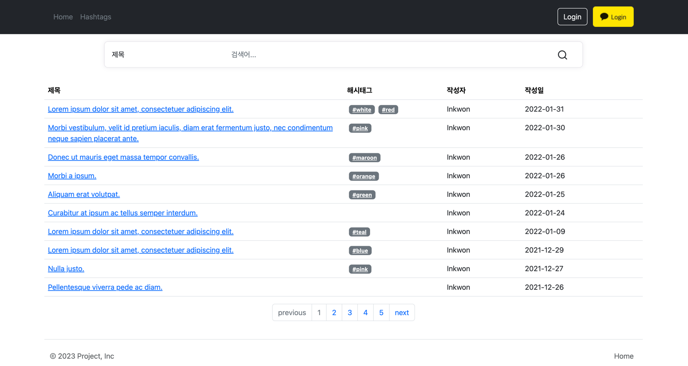
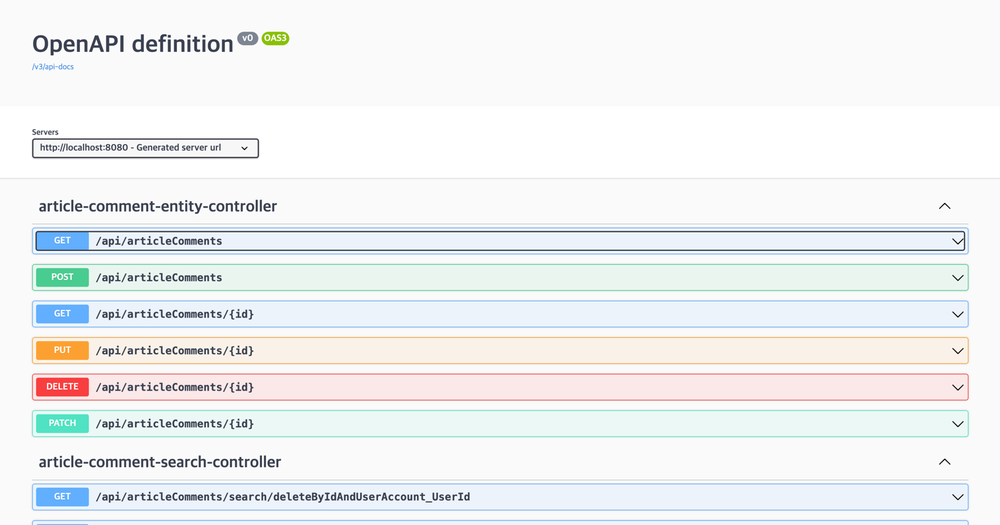

# board_project

게시판 서비스    
스프링 부트와 관련 기술들, 자바 17 기능들, 개발 도구들을 경험할 수 있도록 만들어졌습니다.

# 개발환경
- Intellij IDEA Ultimate 2023.1.3
- Java 17
- Gradle 7.4.1
- Spring Boot 3.1.1
- Git GUI : GitKraken 10.0.2

# 게시판 서비스 주요 기능 소개
- 게시판 글 정렬 : 사용자들이 게시판의 글을 최신순 또는 인기순으로 정렬할 수 있습니다.
- 게시판 검색 : 제목, 본문, 유저 ID, 닉네임, 해시태그 등으로 게시글을 검색할 수 있습니다.
- 해시태그 필터링 : 해시태그를 선택하면 해당 태그가 포함된 게시글들만 따로 볼 수 있습니다.
- 게시글 작성 : 사용자들은 로그인 후에 게시글을 작성할 수 있습니다.
- 댓글 작성 : 게시글에 댓글을 작성하여 소통할 수 있습니다.
- 대댓글 작성 : 게시글 댓글에 댓글을 작성하여 소톨할 수 있습니다.
- 회원 로그인 : 사용자 인증을 통해 로그인 기능을 제공합니다.
- 카카오 로그인 : 카카오 인증을 통해 로그인 기능을 제공합니다.
- 본인 작성 글과 댓글 삭제 : 사용자는 자신이 작성한 글과 댓글을 삭제할 수 있습니다.
- 환경변수를 통한 보안기능 강화
- Swagger UI로 API 문서화 기능

# 기술 세부 스택
- Spring Boot
- Spring Boot Actuator
- Spring Web
- Spring Data JPA
- Rest Repositories
- Rest Repositories HAL Explorer
- springdoc(Swagger UI)
- Thymeleaf
- Spring Security
- oauth2
- vault
- H2 Database
- MySQL Driver
- PostgreSQL
- Lombok
- Spring Boot DevTools
- Spring Configuration Processor

# 그 외
- QueryDSL 5.0.0
- Bootstrap 5.2.0-Beta1

# Reference
- Use-case

- board_project_erd

- API 설계

- 실제 화면

- Swagger UI
